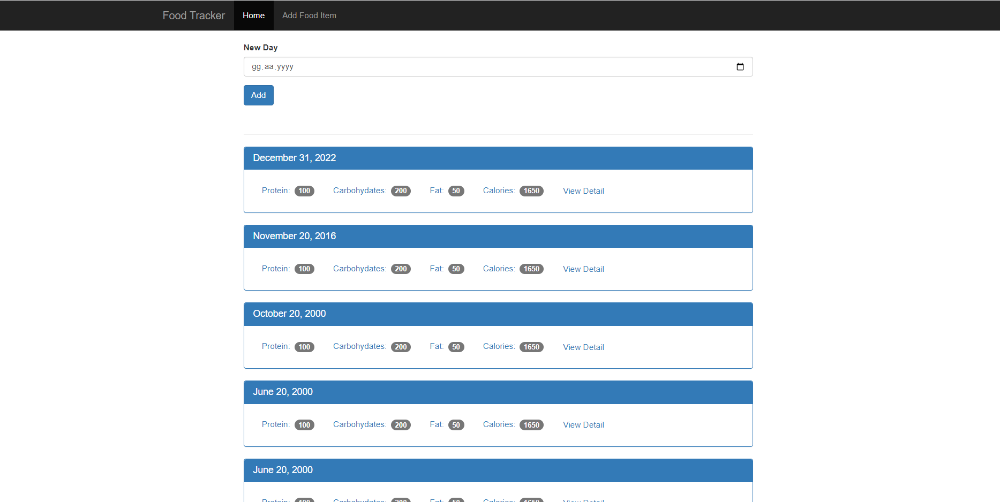
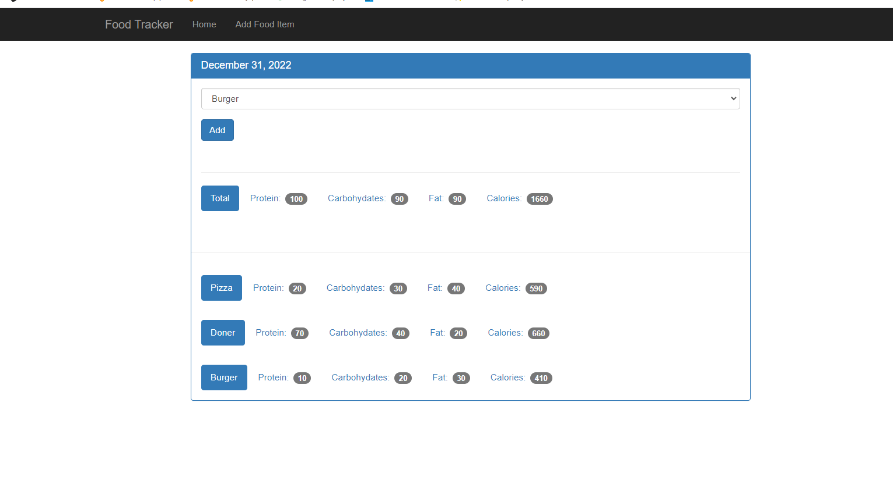
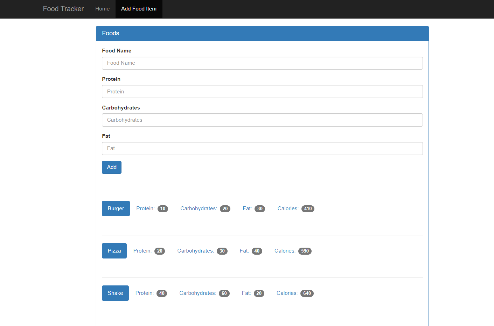

<h1 align="center">Hi 👋, I'm Fatih.</h1>
<h3 align="center">A passionate python developer from Turkey</h3>

Hey there, In this project I have built a food-tracker web app with python Flask framework. 

<h1>Features of the app</h1>
1. You can add food items to your system
2. You can add new date into your home page like today's date 02.01.2023 
3. Finally, you can add food items in those dates you have specified and track your progress from there.

<h1>Improvements in the future?</h1>
-  There will be definetely account feature that will allow you to have a private account
- There will be stats page where there will be a lot of graphs that show your performance.
Of course, there are a lot can be done for this project but those 2 are good enough for me to accomplish in short run. I will put on top of it gradually. 

<h1>What the app looks like</h1>
<h2> Home Page </h2>

 
<h2> Day Section </h2>

 
<h2> Adding Food Section </h2>

- 🌱 I’m currently learning **data structures and web development**

- 💬 Ask me about **python, html&css**

- 📫 How to reach me **sekanti02@gmail.com**

<h3 align="left">Connect with me:</h3>

<h3 align="left">Languages and Tools:</h3>

           

